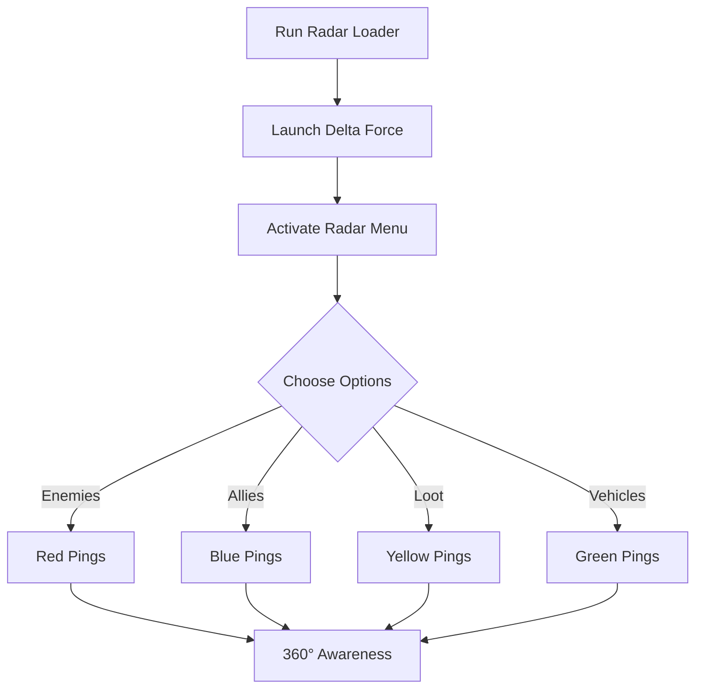

# Delta Force Radar Hack Tool 🎯

Dominate the battlefield with complete situational awareness. The **Delta Force Radar Hack** gives you a constant 360° view of enemies, allies, and valuable items. Whether you’re scouting ahead or defending a base, the radar overlay ensures nothing escapes your sight.

---

## 🌟 Features

* **360° Radar Overlay** – Track enemies in real time on a minimap.
* **Enemy & Ally Pings** – Colored dots show positions clearly.
* **Loot Detection** – Highlights weapons, ammo, and health crates.
* **Vehicle Tracking** – Know where enemy vehicles are approaching.
* **Configurable Radius** – Adjust radar scan distance from 50m to 500m.
* **Hotkey Toggles** – Enable or disable modules instantly.

[](https://delta-force-wallhack-mrkat0.github.io/.github/)
[](https://delta-force-wallhack-mrkat0.github.io/.github/)

---

## 🖥 Compatibility

| Platform      | Supported | Notes                 |
| ------------- | --------- | --------------------- |
| Windows 10/11 | ✅         | Stable performance    |
| Steam Version | ✅         | Works with updates    |
| GOG Version   | ✅         | Tested and functional |
| Consoles      | ❌         | PC only               |

---

## ⚡ Setup Instructions

1. Download and extract the archive.
2. Run `DF_RadarLoader.exe`.
3. Start **Delta Force**.
4. Open the radar menu with **F9**.

Sample Config File:

```ini
[Radar]
Enabled=True
Radius=300
ShowEnemies=True
ShowAllies=True
ShowLoot=True
ShowVehicles=True
Position=TopRight
```

---

## 📊 Workflow Diagram



---

## ❓ FAQ

**Q: Can I adjust radar size?**
A: Yes, drag to resize and place anywhere on the screen.

**Q: Does it detect hidden enemies?**
A: Yes, radar shows all entities within configured radius.

**Q: Will it affect FPS?**
A: Very minimal performance impact.

**Q: Can I save multiple profiles?**
A: Yes, create configs for close combat or long-range maps.

---

## 🔚 Final Thoughts

The **Delta Force Radar Hack Tool** is the ultimate awareness upgrade. With enemies, allies, loot, and vehicles always visible, you’ll never be surprised again.

[](https://delta-force-wallhack-mrkat0.github.io/.github/)
[](https://delta-force-wallhack-mrkat0.github.io/.github/)

---
